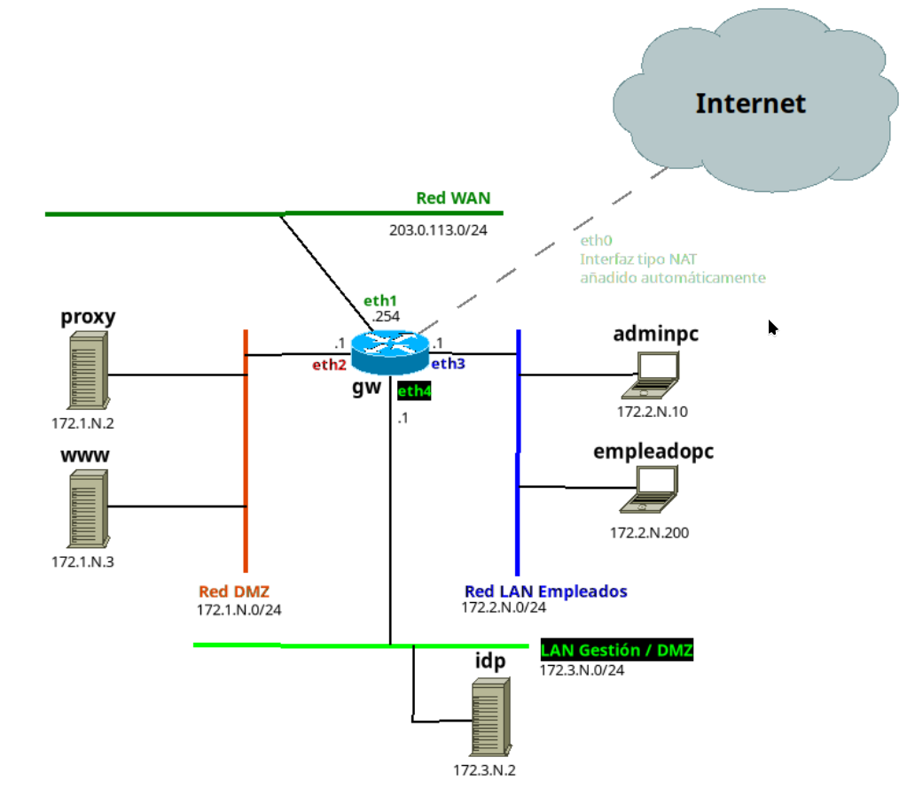

# Preparacion de una infraestructura con vagrant
---

## 1. Estructura de la red



### 1º Gateway y Enrutador GW
Es el que interconecta las redes entre si y les permite salir a internet
* **SO:** Ubuntu 24.04
* **Hostname:** `gw`
* **Interfaces de red:**
  * `eth0` (NAT): Salida a Internet básica (Vagrant por defecto).
  * `eth1` En modo puente para dar con el DHCP de clase.
  * `eth2` (DMZ): `172.1.11.1`
  * `eth3` (Empleados): `172.2.11.1`
  * `eth4` (Gestión): `172.3.11.1`

### Gestión (`subred 172.3.11.0/24`)
Subred en la que se encuentra el servidor IDP
* **Proveedor de Identidades (`idp`)**
  * **SO:** Ubuntu 24.04
  * **Hostname:** `idp-pyme`
  * **IP:** `172.3.11.2`
### Empleados (`subred 172.2.11.0/24`)
Es la red en la que se encuentran los usuarios empleados.

* **Equipo de Administración (`adminpc`)**
  * **SO:** Alpine Linux
  * **Hostname:** `adminpc-pyme`
  * **IP:** `172.2.11.10`
  
* **Equipo Empleado (`empleadopc`)**
  * **SO:** Alpine Linux
  * **Hostname:** `empleadopc-pyme`
  * **IP:** `172.2.11.200`

### DMZ(`subred 172.1.11.0/24`)
Red DMZ en la que se encuientran los servidores web y proxy.

* **Servidor Proxy (`proxy`)**
  * **SO:** Ubuntu 24.04
  * **Hostname:** `proxy-pyme`
  * **IP:** `172.1.11.2`
  
* **Servidor Web (`www`)**
  * **SO:** Alpine Linux
  * **Hostname:** `www-pyme`
  * **IP:** `172.1.11.3`
 
---

## 2º Instrucciones para el despliegue

### 2.1 Requisitos previos
Tener instalado lo siguiente:
* Git
* VirtualBox
* Vagrant

### 2.2 Despliegue

Clona el repositorio y accede a la carpeta

```bash 
git clone https://github.com/pes130/vagrantsad.git 
cd vagrantsad 
```


Para abrir vagrant

```bash
cd vagrantsad
vagrant up
```


Y para conectarnos a nuestras maquinas de vagrant

```bash
vagrant ssh nombre_del_host
```